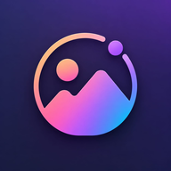

<div align="center">
</br>


</div>

<h1 align="center">Edits Photo</h1>

</br>

<p align="center">
  
  
  
  
</p>

<h4 align="center">Powerful picture editor with AMOLED black theme — crop, apply filters, draw, erase background, edit EXIF, create PDFs and more.</h4>

# ✨ Features

- Batch processing
- Applying filter chains
- AES-256 GCM file encryption and decryption
- EXIF metadata editing/deleting
- Loading images from internet
- Image Stitching
- Background Removal
- Watermarking (Text & Image)
- Drawing (Pen, Neon, Highlighter, Blur, Pixelation, Shapes, Lasso)
- Image Resizing (Width/Height, Adaptive, Aspect Ratio, Center Crop)
- GIF & APNG conversion
- Image Shrinking & Compression
- Cropping (Regular, Aspect Ratio, Shape Masks)
- Format Conversion (WEBP, JPEG, PNG, SVG)
- Files to Zip
- Image Comparison (Slide, Toggle, Side By Side)
- Color Utils (Palette, Color Picker, Gradients)
- PDF Tools
- Dark / AMOLED black theme
- Welcome screen with animations
- WhatsApp support contact

# 📲 Download

Download the latest APK from the [Releases](https://github.com/THEMASTERFF207/EditsPhoto/releases/latest) page.

# ☕ Support

If you find this app useful, consider supporting the development:

- WhatsApp: +1 (809) 341-9870
- Web: https://mi-link-web.netlify.app/

# ⚖️ License

```
Designed and developed by THEMASTERFF207

Licensed under the Apache License, Version 2.0 (the "License");
you may not use this file except in compliance with the License.
You may obtain a copy of the License at

   http://www.apache.org/licenses/LICENSE-2.0

Unless required by applicable law or agreed to in writing, software
distributed under the License is distributed on an "AS IS" BASIS,
WITHOUT WARRANTIES OR CONDITIONS OF ANY KIND, either express or implied.
See the License for the specific language governing permissions and
limitations under the License.
```

Based on [Image Toolbox Lite](https://github.com/T8RIN/ImageToolbox) by T8RIN — Apache 2.0 License.
